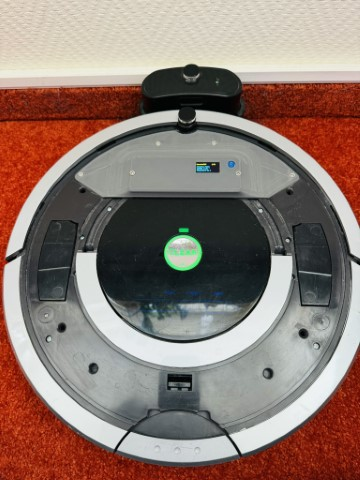
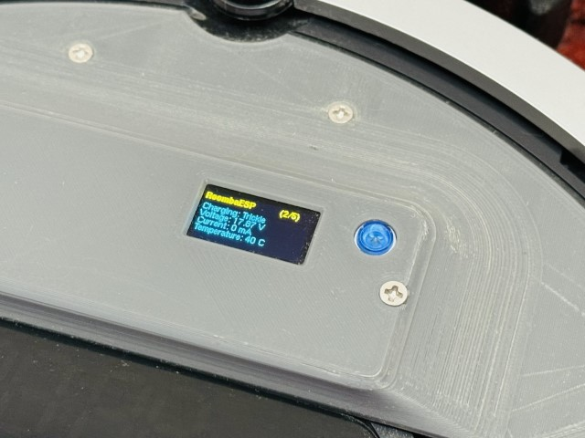
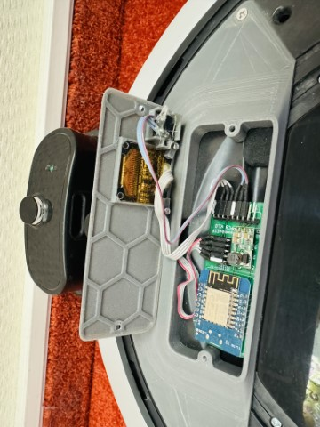

# RoombaESP

This project is a Add-On PCB for the Roomba vacuum cleaner robots of series 500/600/700. It uses the open interface of the Roomba to control the robot via a ESP8266 microcontroller. The PCB is designed to be mounted on top in a 3D printed case and add

- MQTT
- REST API
- Monitoring Interface
- OLED Screen
- Status LED

## PCB

## Case & Features

